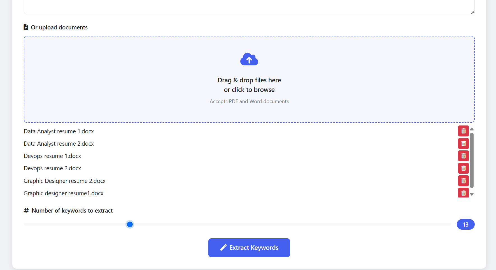
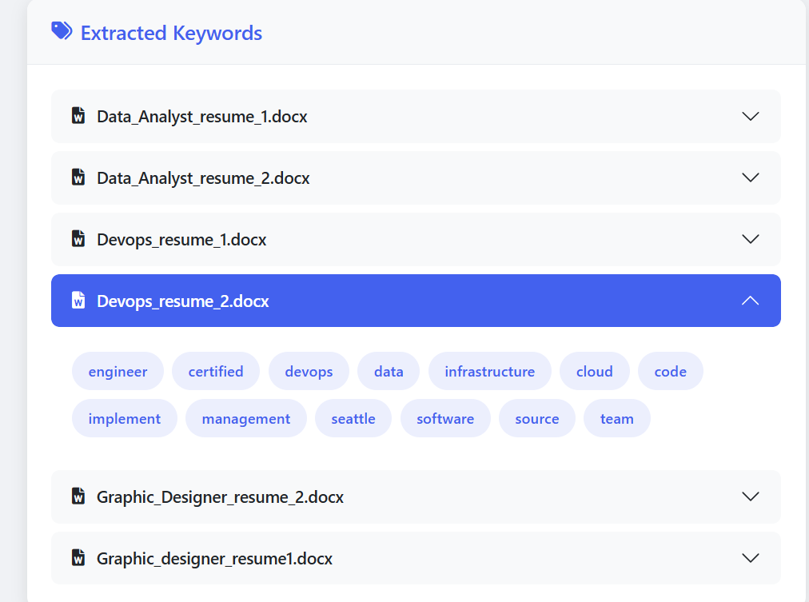
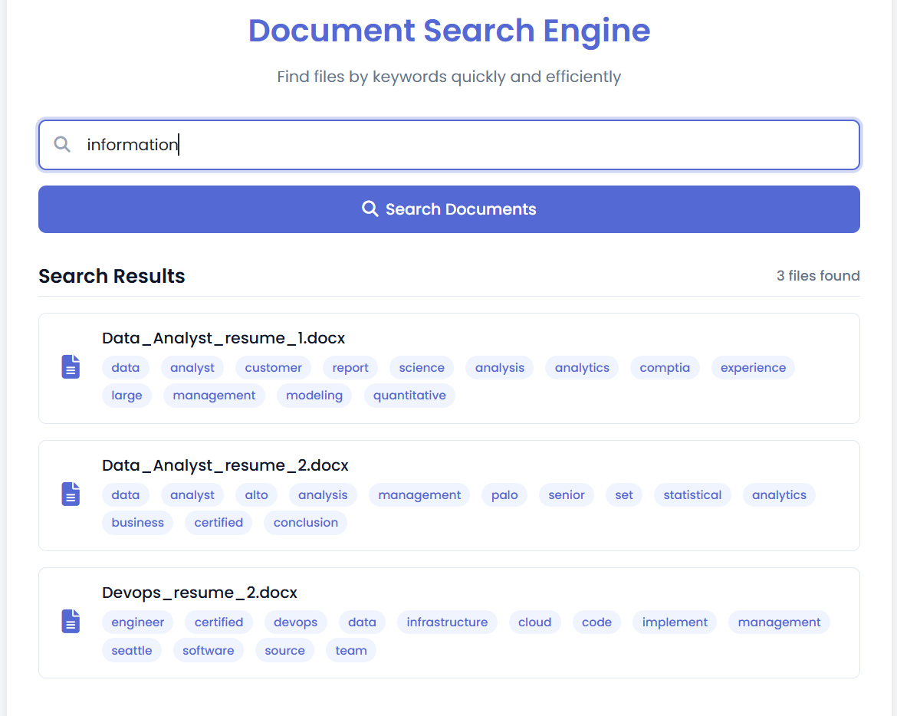
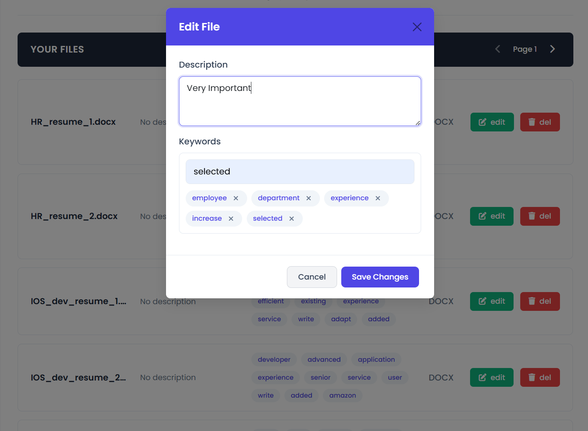
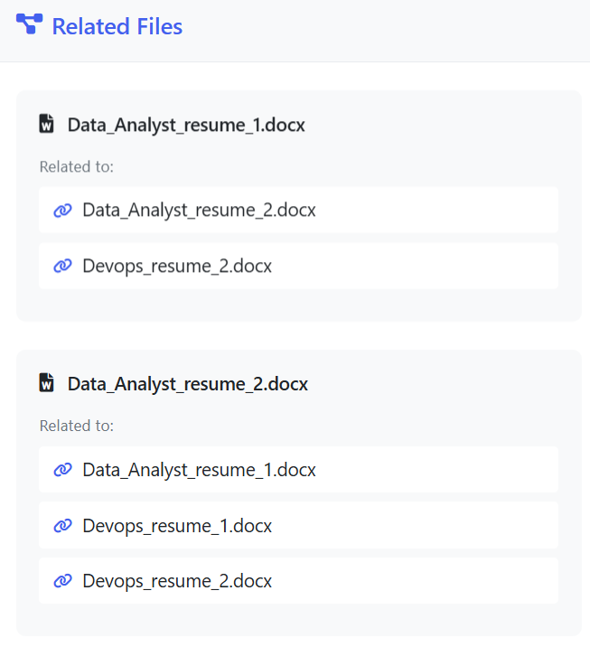
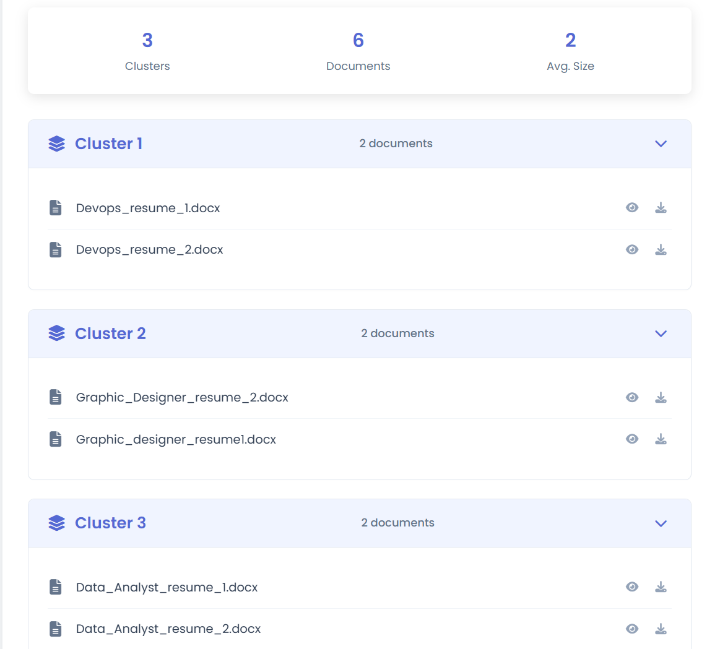

# 🔍 Smart File Search & Grouping System using Keyword Extraction

An intelligent document management platform that leverages NLP and unsupervised learning to automatically extract keywords, cluster similar documents, and provide advanced semantic search — built with Python, Flask, MongoDB, and Scikit-learn.

---

## 📌 Table of Contents

- [Overview](#overview)
- [Key Features](#key-features)
- [Tech Stack](#tech-stack)
- [Architecture](#architecture)
- [How It Works](#how-it-works)
- [Screenshots](#screenshots)
- [Setup & Installation](#setup--installation)
- [Evaluation Metrics](#evaluation-metrics)
- [Future Scope](#future-scope)

---

## 🧠 Overview

In today's data-heavy world, managing documents manually is inefficient. This project introduces a **smart file management system** that:

- Automatically extracts meaningful keywords from PDF and DOCX files using **TF-IDF**.
- Groups similar documents via **KMeans clustering**.
- Allows users to perform **semantic search**, including **synonym support**.
- Supports **manual keyword tagging**, **metadata editing**, and **related document discovery**.

---

## ✨ Key Features

| Feature                | Description                                              |
| ---------------------- | -------------------------------------------------------- |
| 📂 Multi-File Upload   | Upload multiple PDF/DOCX files for analysis.             |
| 🧹 Text Preprocessing  | Lowercasing, stopword removal, lemmatization, etc.       |
| 🧠 Keyword Extraction  | Unigram-based TF-IDF for meaningful term identification. |
| 🧮 Document Clustering | KMeans algorithm groups related documents.               |
| 🔍 Semantic Search     | Find files by exact terms or synonyms (WordNet).         |
| 🏷️ Manual Tagging      | Add/edit/remove custom tags per document.                |
| 🤝 Related Files       | Suggests documents with shared or overlapping keywords.  |
| 📊 Evaluation Metrics  | Precision, Recall, and F1 scores from benchmark dataset. |

---

## 🛠️ Tech Stack

- **Frontend**: HTML, CSS (Flask templates)
- **Backend**: Python, Flask, Flask-CORS
- **NLP**: `nltk`, `pdfplumber`, `python-docx`
- **Clustering & Vectors**: `scikit-learn`
- **Database**: MongoDB (via `pymongo`)
- **Testing Dataset**: [BBC Article Tagging](https://huggingface.co/datasets/zino36/Tags-Generation-dataset)

---

## 🧬 Architecture

**System Flow:**

1. 🧾 User uploads files (.pdf or .docx)
2. 🔍 Text is extracted using `pdfplumber` / `python-docx`
3. 🧹 Preprocessing:
   - Lowercasing
   - Stopword removal
   - Lemmatization
4. 🧠 Keyword Extraction (TF-IDF)
5. 📊 Clustering (KMeans)
6. 🔍 Search (with WordNet synonyms)
7. 🏷️ Manual Tagging (stored in MongoDB)
8. 📚 Related File Suggestion

---

## ⚙️ How It Works

### 1. **Text Preprocessing**

- Lowercasing
- Removing stopwords and punctuation
- Lemmatization
- Sentence segmentation

### 2. **TF-IDF Keyword Extraction**

- Uses unigrams only (avoids bigram redundancy)
- Extracts top-N high-weighted keywords

### 3. **Document Clustering**

- Vectorizes keyword lists again
- Applies **KMeans** clustering (default `k=3`)
- Groups semantically similar files

### 4. **Search Engine**

- Matches keywords across all files
- Expands search with **WordNet synonyms**
- Ranks results by keyword overlap

### 5. **Manual Metadata Support**

- Add or remove tags
- Add descriptions for each file
- Stored persistently in MongoDB

### 6. **Related File Discovery**

- Compares keyword intersections
- Suggests files with shared semantics

---

## 🖼️ Screenshots

- 📥 Multi-file Upload
  
- 🧠 Keyword Output per File
  
- 🔍 Search Interface
  
- 🏷️ Manual Tag & Description Editor
  
- 📚 Related Files Suggestions
  
- 📊 Clustering
  

---

## 🚀 Setup & Installation

### 🔧 Prerequisites

- Python 3.10+
- MongoDB running locally or in the cloud

### 📦 Install Dependencies

```bash
pip install -r requirements.txt
```

Or manually:

```bash
pip install flask flask-cors nltk pandas pdfplumber python-docx scikit-learn pymongo
```

### ▶️ Run the App

```bash
python app.py
```

App runs on: `http://127.0.0.1:5000`

---

## 🧪 Evaluation Metrics

| Strategy                  | Precision | Recall | F1 Score |
| ------------------------- | --------- | ------ | -------- |
| Equal to gold keywords    | 0.4749    | 0.5020 | 0.4875   |
| 50% of gold keyword count | 0.6674    | 0.3404 | 0.4502   |

- Dataset: BBC News Article Tagging
- Metric Level: Token-based comparison

---

## 🌍 Future Scope

- 🔤 **Multilingual Support**
- 🤖 **Transformer Integration (BERT, GPT)**
- 🧠 **Topic Modeling with BERTopic**
- ☁️ **Cloud Storage (Google Drive, OneDrive)**
- 🔁 **Live Ingestion & Real-Time Clustering**
- 📈 **Interactive Visual Dashboards**

---

## 🤝 Acknowledgements

This project was developed as part of an academic initiative in intelligent document management and NLP-based automation.

> 💬 _“This project taught me to balance user interactivity with intelligent automation—bridging NLP, search relevance, and data clustering in one unified platform.”_
